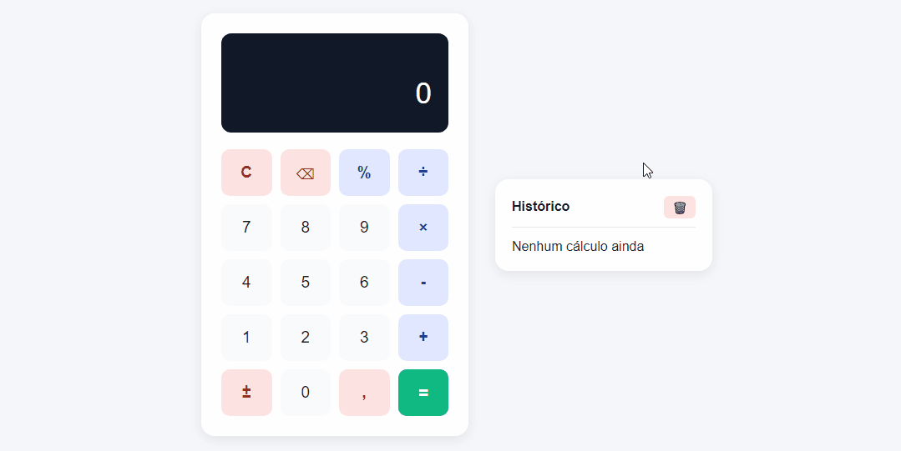

# 🧮 Calculadora Interativa
Este projeto é uma **calculadora interativa desenvolvida em JavaScript**, com suporte a histórico de cálculos, mapeamento de teclado e formatação de números no padrão brasileiro.  
O objetivo foi criar uma aplicação funcional e intuitiva, com foco em **usabilidade, legibilidade e manutenibilidade do código**, além de explorar boas práticas de manipulação do DOM e lógica de programação.

---

## 📷 Demonstração



---

## 🚀 Funcionalidades

* **Operações básicas**: soma, subtração, multiplicação e divisão
* **Recursos adicionais**:

  * Percentual (`%`)
  * Alternância de sinal (+/-)
  * Inserção de ponto decimal
  * Deleção de último dígito
  * Limpeza de display
* **Histórico de operações**:

  * Registro automático de cada cálculo
  * Opção de limpar histórico
* **Interface dinâmica**:

  * Ajuste automático da fonte conforme o número de caracteres
  * Exibição de operação em andamento no display secundário
* **Tratamento de erros**:

  * Mensagens para divisões inválidas (ex: *Erro* e *Indefinido*)
* **Suporte ao teclado**:

  * Números, operações e teclas de controle (`Enter`, `Backspace`, `Delete`)

---

##  🛠️ Tecnologias Utilizadas

* **HTML5** → Estrutura da aplicação
* **CSS3** → Estilização e responsividade
* **JavaScript (ES6+)** → Lógica da calculadora e manipulação do DOM

---

## 📖 Como Usar

Você pode acessar a versão online aqui:
[Demonstração Online](https://devrodrigobrito.github.io/calculadora-interativa/)  
Ou, se preferir rodar localmente em sua máquina:    

1.  **Clone o repositório:**
    ```bash
    git clone https://github.com/devrodrigobrito/calculadora-basica.git
    ```

2.  **Navegue até o diretório do projeto:**
    ```bash
    cd calculadora-interativa
    ```

3.  **Abra o arquivo HTML:**
    Abra o arquivo `index.html` em qualquer navegador moderno (como Google Chrome, Firefox ou Microsoft Edge).

---

## 📚 Aprendizados

Durante o desenvolvimento, foram reforçados conceitos como:

* Estruturação de lógica para cálculos matemáticos
* Boas práticas na separação de funções e variáveis de estado
* Tratamento de erros e validação de entradas
* Formatação de números conforme o padrão `pt-BR`

---

## 👨‍💻 Autor

Desenvolvido por **Rodrigo Brito**   
[LinkedIn](www.linkedin.com/in/devrodrigobrito) | [GitHub](https://github.com/devrodrigobrito)


